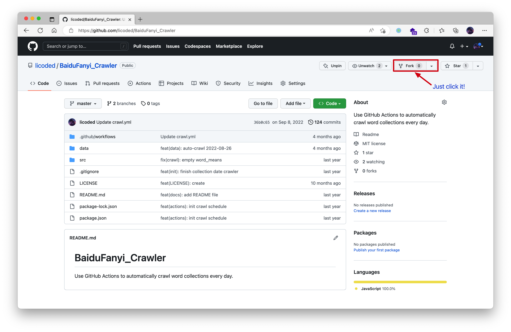
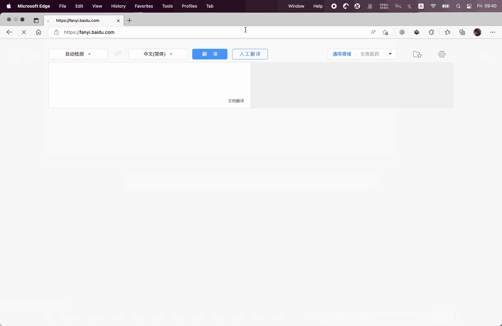
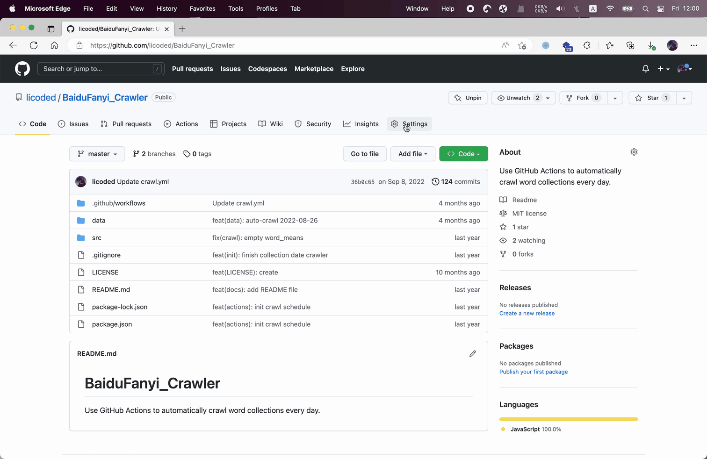
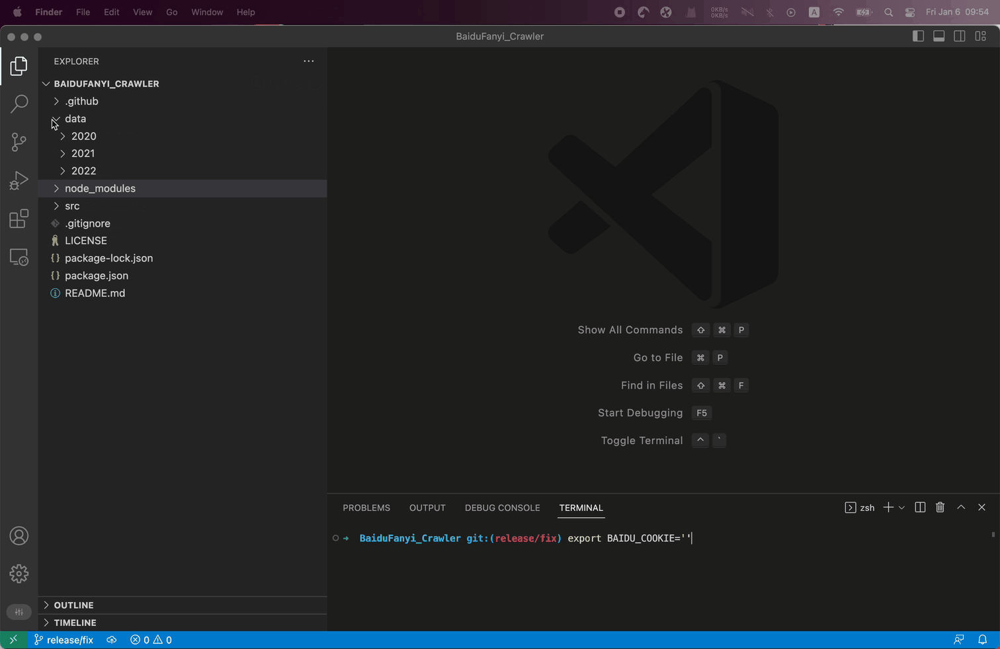

# BaiduFanyi_Crawler
Use GitHub Actions to automatically crawl word collections every day.

## Get Started

### 1. fork this [repo](https://github.com/licoded/BaiduFanyi_Crawler).

### 2. get cookie

### 3. set action secrets

## Run in Local

